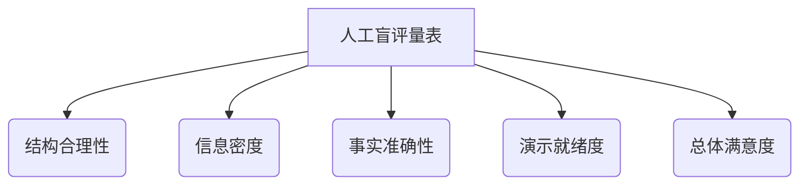

# PPT 大纲与内容生成：人工评估（盲评）量表细则

本指南旨在为 PPT 智能生成系统的生成内容进行**双盲人工评估**提供统一的标准。评估人员在评分时，应当在不了解生成路径（如纯 LLM、LLM+RAG 或 LLM+RAG+DeepResearch）和生成模型的情况下，客观比对生成样本，并依照本细则进行 1-5 分的打分。

---

## 一、 盲评操作流程

1. **样本脱敏与混洗**：由非评估人员将评估样本进行编号（如样本 A、样本 B、样本 C），并剔除任何表明其模型名称、提示词机制或系统配置（如 "基于检索"）的元数据。
2. **独立评分**：两位或两位以上的评估人分别独立阅读生成的大纲或幻灯片内容，并对照本量表细则进行打分。
3. **一致性检查**：当不同评估人对同一维度的评分偏差超过 1 分时，需对差异进行讨论，必要时由第三人进行仲裁或重新评估。

---

## 二、 5 级量表评分细则

评分包括以下五个核心维度：**结构合理性、信息密度、事实准确性、演示就绪度、总体满意度**。

---

### 维度 1：结构合理性 (Structural Rationality)
*主要评估：叙事逻辑流（Logical Flow）、章节脉络（Chapters）、大纲层级结构是否符合受众和演示时间的预期。*

| 分值 | 评级 | 详细判断标准 |
| :---: | :---: | :--- |
| **5** | **极佳 (Excellent)** | 逻辑链条极其紧密，章节过渡流畅，完全匹配设定的受众角色与演示时长，无任何逻辑断层。 |
| **4** | **优良 (Good)** | 整体逻辑清晰，分章合理。大部分内容有明确的演进线索。可能有极少数不关键的页面在层级归属上略有偏差，但不影响整体叙事流。 |
| **3** | **合格 (Fair)** | 具备基本的大纲框架，完成了任务要求的主要板块。但结构略显平庸、前后章节有轻微重复或过渡生硬，对于特定演示时间而言大纲容量偏紧或偏松。 |
| **2** | **欠佳 (Poor)** | 结构逻辑混乱，章节划分不合理或前后顺序错乱，受众很难捕捉到叙事的主线。包含大量逻辑断层或不相关板块。 |
| **1** | **极差 (Very Poor)** | 完全没有合理的叙事逻辑，内容层级错乱（如章节与单页内容混淆），或仅是无序的知识碎片堆砌。 |

---

### 维度 2：信息密度 (Information Density)
*主要评估：关键信息覆盖率、论点深入程度以及内容的冗余性（避免空洞泛泛之谈）。*

| 分值 | 评级 | 详细判断标准 |
| :---: | :---: | :--- |
| **5** | **极佳 (Excellent)** | 信息量饱满。在满足大纲字数限制的前提下，核心论点深刻，并提供了充足、精准的细节支撑（如具体案例、阶段模型或核心论据），无任何空洞废话。 |
| **4** | **优良 (Good)** | 信息丰富度高，能够支撑起各页的核心意图。大部分页面提供了具体的阐述，但可能有少数页面内容显得稍微宽泛，或者存在极少量的套话。 |
| **3** | **合格 (Fair)** | 信息量尚可，覆盖了主题基本面。但内容多为常识性的浅显结论，缺乏深入的细分论点或实例支撑，语言组织偏平淡或略有重复。 |
| **2** | **欠佳 (Poor)** | 信息密度严重不足，内容泛泛而谈。多页内容大同小异，或者关键的背景/细节完全缺失。 |
| **1** | **极差 (Very Poor)** | 极度贫乏。整篇都是废话、无意义的词汇堆砌，或者字数严重达不到基本演示要求，无法获取任何实质信息。 |

---

### 维度 3：事实准确性 (Factual Accuracy)
*主要评估：内容是否违背常识或行业事实、是否存在模型幻觉（Hallucination）、对关键专业知识/数据/年份的表述是否可靠。*

> [!IMPORTANT]
> 此指标是验证 RAG（检索增强）与 DeepResearch（网络搜索）效果的关键核心指标。评估时需重点核实生成内容中的专有名词、数据、年份、法律条文或科学事实。

| 分值 | 评级 | 详细判断标准 |
| :---: | :---: | :--- |
| **5** | **极佳 (Excellent)** | 完全准确，贴合事实。提及的数据、政策条文、历史年份或专业术语均完全真实无误，与客观事实/背景参考资料完全吻合。 |
| **4** | **优良 (Good)** | 整体事实可靠。没有严重的事实错误。仅有极其微小的偏差（例如引用范围略微笼统，或者非核心数据的小数点四舍五入偏差）。 |
| **3** | **合格 (Fair)** | 存在个别明显的事实小漏洞或轻度幻觉（如张冠李戴，混淆了某些相似的概念），但核心结论和主流事实依然成立，可通过少量人工修改挽回。 |
| **2** | **欠佳 (Poor)** | 事实错误较多或幻觉严重。出现了常识性错误、张冠李戴、或虚构了不存在的政策/历史背景。 |
| **1** | **极差 (Very Poor)** | 事实完全错误，不可信。 |

---

### 维度 4：演示就绪度 (Presentation Readiness)
*主要评估：生成的大纲/内容是否符合 PPT 独有的表达规范，是否能直接被设计师或渲染引擎使用。具体包括：每页意图明确、`must_cover` 提取为易展示的短语而非大段段落、整体具有视觉化呈现的潜力。*

| 分值 | 评级 | 详细判断标准 |
| :---: | :---: | :--- |
| **5** | **极佳 (Excellent)** | 高度契合 PPT 排版需求。页面意图（intent）直观清晰；`must_cover` 中的关键点呈高度精炼的短语形式（每条不超过 30 字），非常便于直接转换为 PPT 的分点或卡片；核心结论（takeaway）一针见血，能立即进行视觉化渲染。 |
| **4** | **优良 (Good)** | 格式完备，符合规范要求。页面要点提炼基本到位，可以直接被渲染。个别句式可能稍微偏长，但只需微调即可直接交付使用。 |
| **3** | **合格 (Fair)** | 基本符合大纲规范。但是部分页面的 `must_cover` 段落感略强（如包含过多介词或修饰语，不够短语化），或者页面表达较长，渲染成 PPT 时会显得文字有些拥挤。 |
| **2** | **欠佳 (Poor)** | 演示就绪度低。生成内容像是一篇缩水的作文，未做短语提炼。页面要点杂乱，很难直接做视觉化排版，需要重写大部分文案。 |
| **1** | **极差 (Very Poor)** | 完全不符合 PPT 文体结构。完全是大段大段的文本复制，或者只有题目没有具体内容骨架，完全无法用于渲染生成 PPT。 |

---

### 维度 5：总体满意度 (Overall Satisfaction)
*主要评估：综合评估体验。如果由评估人来做汇报，是否愿意直接或仅在极微小修改后使用该生成成果。*

| 分值 | 评级 | 详细判断标准 |
| :---: | :---: | :--- |
| **5** | **极佳 (Excellent)** | 几乎不需要进行任何修改，可以直接导出使用或直接汇报。 |
| **4** | **优良 (Good)** | 只需要花 5 到 10 分钟在措辞或个别细节上进行润色，就可以拿去汇报。 |
| **3** | **合格 (Fair)** | 大纲和内容能用，但需要花一些时间进行重构、修饰或补充论据才能达到演示门槛。 |
| **2** | **欠佳 (Poor)** | 生成的内容比较鸡肋，需要推倒大部分重来，只保留了少量有用内容。 |
| **1** | **极差 (Very Poor)** | 毫无用处，需要自己从零开始写。 |

---

## 三、 人工评估记录表模板（推荐）

推荐在盲评过程中，使用如下格式的表格记录打分，并将其作为技术验证报告的数据支撑。

| 评估样本编号 | 结构合理性评分 (1-5) | 信息密度评分 (1-5) | 事实准确性评分 (1-5) | 演示就绪度评分 (1-5) | 总体满意度评分 (1-5) | 综合得分 (均值) | 评测备注 (例如：事实准确性失分原因) |
| :---: | :---: | :---: | :---: | :---: | :---: | :---: | :--- |
| **A-01** | | | | | | | |
| **A-02** | | | | | | | |
| **A-03** | | | | | | | |
| **B-01** | | | | | | | |
| **B-02** | | | | | | | |
| **B-03** | | | | | | | |
