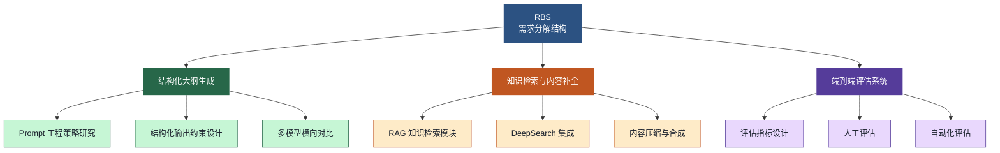
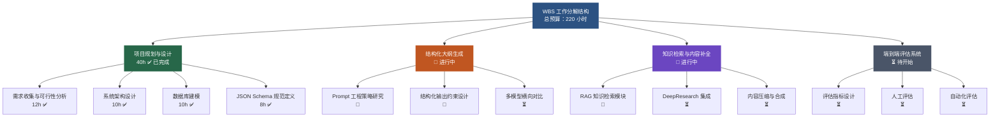
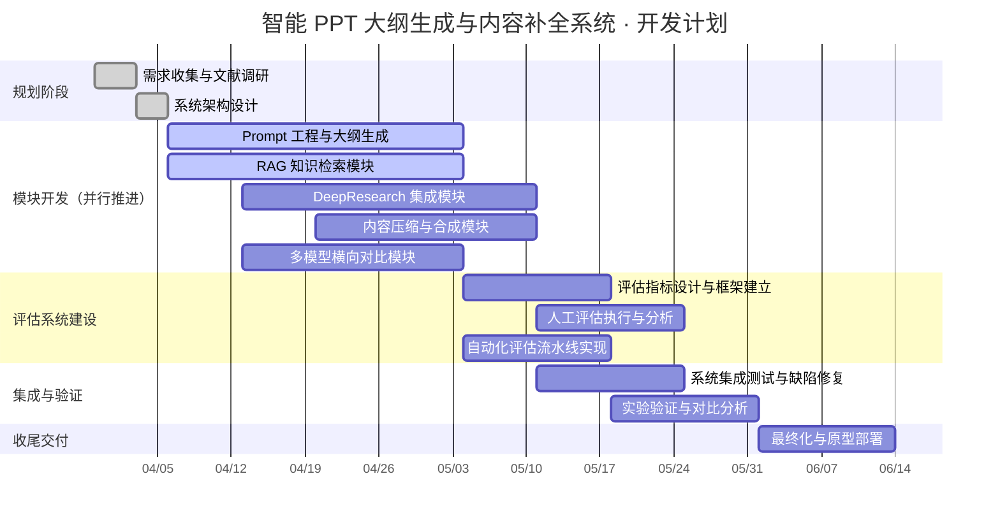
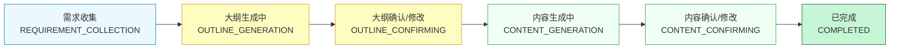

# PPT 大纲智能生成与内容补全系统
## 前两周成果汇报

> 同济大学 × 合合信息 | 项目团队：马小龙、汤诚阳、张睿琦、谢景丞

---

# 第一部分：项目介绍

---

## 1.1 问题背景与现实痛点

**PowerPoint 制作的固有困境**

在企业汇报、学术展示及内部沟通等典型场景中，高质量 PPT 的制作通常涉及以下多个耗时环节：

- 对主题进行系统性分析，厘清汇报逻辑
- 从多源渠道检索、筛选并核实外部信息
- 构建合理的章节结构与叙事顺序
- 将复杂信息提炼为适合单页展示的精炼要点
- 根据反馈进行多轮迭代修改

整体过程少则数小时，多则跨越数天；对缺乏经验的用户而言，"不知道从哪里开始"往往是最大的认知障碍。

---

## 1.2 现有 AI PPT 工具的局限性

| 问题维度 | 现有工具的表现 | 本系统的改进目标 |
|----------|--------------|----------------|
| **内容可靠性** | 纯 LLM 生成，缺乏真实数据支撑，易产生"正确但空洞"的内容 | RAG + DeepSearch 提供外部知识增强 |
| **信息时效性** | 模型训练知识存在截止日期，无法反映最新动态 | 实时网络检索补充最新信息 |
| **结构灵活性** | 模板固化，无法根据具体汇报场景与受众动态调整 | JSON Schema 约束 + 多轮对话动态调整 |
| **私有知识利用** | 不支持用户上传私有文档作为知识来源 | 支持上传企业文档、研究报告等私有资料 |
| **交互深度** | 一次性生成，无法在同一会话中持续迭代 | 多阶段、可中断、可恢复的全流程管理 |

---

## 1.3 系统定位与核心目标

**系统定位**

> 本系统定位为**面向内容深度生成的智能 PPT 创作辅助系统**，而非简单的"一键生成"工具。
> 其核心目标是：通过融合大语言模型的内容生成能力与外部知识增强机制，将用户输入的简短主题或长文档，稳定转译为结构清晰、内容可靠、有数据支撑的 PPT 草稿。

**项目成功标准**

| 评估维度 | 具体指标 |
|----------|---------|
| 效率维度（AC） | 用户 PPT 制作时间降低至少 **50%** |
| 质量维度（IS） | 大纲结构合理性通过率 ≥ **90%**；相较纯 LLM 方案，内容准确性与信息相关性显著提升 |
| 体验维度（IS） | 用户体验评分 ≥ **4/5**（基于实验评估） |
| 产品维度（IR） | 系统具备产品化潜力，可集成于智能办公工具 |

---

## 1.4 两种创作路径

**路径一：报告驱动模式（REPORT_DRIVEN）**

适用场景：用户已持有完整文档（研究报告、调研数据、会议纪要等），希望快速提炼为 PPT 大纲。

```
用户发送首条消息（携带文件）
  → 系统自动识别 → session_type = REPORT_DRIVEN
  → 文档解析与文本提取
  → 跳过需求收集，直接进入大纲生成
  → 大纲确认 → 内容生成（报告文本作为 RAG 知识注入）→ 导出
```

**路径二：引导式创作模式（GUIDED）**

适用场景：用户仅有一个模糊的主题想法，需要系统协助明确需求并检索外部信息（**核心场景**）。

```
用户发送首条消息（纯文字主题）
  → 系统自动识别 → session_type = GUIDED
  → 多轮对话收集需求（主题、受众、时长、风格、重点）
  → 需求完整后进入大纲生成
  → 大纲确认/修改 → 内容生成（RAG + DeepSearch 并行增强）→ 导出
```

**核心创作阶段（六阶段单向流转，状态持久化）**

```
需求收集 → 大纲生成中 → 大纲确认/修改 → 内容生成中 → 内容确认/修改 → 已完成
```

---

## 1.5 技术栈概览

| 技术层次 | 选型 | 核心作用 |
|----------|------|----------|
| **前端** | React + TypeScript + Vite | 对话界面、大纲编辑器、SSE 流式展示 |
| **后端框架** | FastAPI（Python 3.11，全异步） | API 网关、业务逻辑、SSE 长连接 |
| **关系型数据库** | PostgreSQL + pgvector | 核心业务数据 + 文档向量一体化存储 |
| **消息队列** | Redis Stream | 知识库文件异步处理队列 |
| **对象存储** | OSS（S3 协议兼容） | 用户上传原始文件持久化 |
| **LLM 接入** | 标准化兼容接口，多服务商可配置 | 大纲生成、意图识别、内容生成 |
| **Embedding** | 阿里云 DashScope text-embedding-v3（固定） | 文档向量化，维度统一保障检索一致性 |
| **向量检索** | LlamaIndex + pgvector（余弦相似度） | RAG 知识检索，Top-K 段落召回 |
| **AI 编排** | LangChain + LangGraph | RAG 流程编排、多轮检索调度 |
| **深度搜索** | 网络搜索 API（搜索服务商可配置） | 实时互联网信息检索与聚合 |
| **安全认证** | JWT 双 Token + Redis 黑名单 | 无状态认证 + Token 即时吊销 |
| **容器化** | Docker + docker-compose | 本地开发环境一键部署 |

---

# 第二部分：项目 RBS（需求分解结构）

---

## 2.1 RBS 图示



---

## 2.2 结构化大纲生成

本模块将用户输入的主题描述或文档内容转化为四级 PPT 叙事骨架（章节 → 页面 → 要点 → 备注）。

- **Prompt 工程策略研究**：系统性设计并对比多种提示工程策略（思维链提示、少样本学习等），通过量化指标筛选最优方案
- **结构化输出约束设计**：以 JSON Schema 约束 LLM 输出，确保任何模型的大纲输出始终符合预定义层级规范，保障下游稳定性
- **多模型横向对比**：在大纲生成任务上对多款主流大语言模型进行生成稳定性、输出质量、响应效率的横向比较，以数据驱动技术选型

---

## 2.3 知识检索与内容补全

本模块为每页 PPT 自动检索、过滤、压缩外部知识，补充高质量文本、数据与论据。

- **RAG 知识检索模块**：以大纲节点（页面主题与要点）为检索锚点，自动改写为查询语句，通过向量相似度搜索召回私有知识库中的相关段落
- **DeepSearch 集成**：接入网络搜索 API，实现多轮查询改写与跨源信息聚合，为知识库未覆盖内容提供实时互联网信息补充
- **内容压缩与合成**：将检索到的长文本智能压缩为符合单页 PPT 展示约束的精炼要点，提取关键数据、核心观点与支撑证据

---

## 2.4 端到端评估系统

本模块建立专项多维度评估框架，采用人工评估与自动化指标双轨并行策略。

- **评估指标设计**：结构合理性（章节组织、幻灯片粒度）、信息密度（每页信息量）、事实准确性（正确事实陈述比例）
- **人工评估**：小规模同伴评估，关注清晰度、完整性、展示就绪度
- **自动化评估**：ROUGE、BERTScore 等 NLP 指标结合 PPT 专项规则评分

---

## 2.5 团队责任分工

| 技术方向 | 核心职责描述 |
|----------|-------------|
| 整体架构 & 后端核心 | 系统架构设计、FastAPI 后端网关开发、Session/Task 异步状态机实现 |
| Prompt 工程 & 模型对比 | Prompt 策略优化（含 JSON Schema 约束、意图识别）、多模型横向性能对比实验 |
| RAG 检索 & 数据存储 | RAG 知识检索模块（pgvector 向量存储）、文档解析逻辑、Redis Stream 异步队列维护 |
| 前端开发 & 端到端评估 | 前端 UI（React + Vite）、SSE 流式输出集成、自动化端到端评估系统构建 |

---

# 第三部分：项目 WBS（工作分解结构）

---

## 3.1 WBS 概述与总体图示

工作分解结构（WBS）是将项目拆解为较小、可管理工作单元的系统性方法，帮助项目团队明确各阶段具体任务与责任边界。本项目 WBS 的核心工作领域均源自 RBS（需求分解结构）的最底层需求，覆盖**结构化大纲生成**、**知识检索与内容补全**、**端到端评估系统**三大核心工作领域，并以**项目规划与设计**作为前置基础阶段，总预算工时 220 小时。



---

## 3.2 阶段一：项目规划与设计（✅ 已完成，40h）

| 编号 | 任务名称 | 负责方向 | 预算工时 | 状态 |
|------|---------|---------|---------|------|
| 1.1 | 需求收集与技术可行性分析 | 全体 | 12h | ✅ 完成 |
| 1.2 | 系统架构设计 | 整体架构 & 后端核心 | 10h | ✅ 完成 |
| 1.3 | 数据库建模 | RAG 检索 & 数据存储 | 10h | ✅ 完成 |
| 1.4 | 四级 PPT 大纲 JSON Schema 规范定义 | Prompt 工程 & 模型对比 | 8h | ✅ 完成 |

**阶段一核心成果**：技术栈最终确定（React / FastAPI / PostgreSQL + pgvector / Redis Stream）；系统五层架构设计文档完成；12 张核心数据库表 Schema 建模完成；四级 PPT 大纲 JSON Schema 规范锁定，为结构化输出奠定统一基础。

---

## 3.3 结构化大纲生成（🔄 进行中）

本工作领域致力于通过 Prompt 工程策略研究、结构化输出约束设计与多模型横向对比，实现高质量、可控结构的 PPT 大纲自动生成能力，是本系统的核心竞争力之一。

### 3.3.1 Prompt 工程策略研究

本项目将系统研究各类 Prompt 工程策略对大纲质量的影响，设计并对比不同提示方法，识别能够生成逻辑连贯、结构合理 PPT 大纲的最优策略。

| 子任务 | 具体工作内容 | 状态 |
|--------|------------|------|
| 设计思维链提示模板 | 针对章节划分逻辑、页面粒度把控、叙事连贯性三个维度分别设计 Chain-of-Thought 提示模板 | 🔄 进行中 |
| 构建少样本示例库 | 收集高质量 PPT 大纲样本，覆盖商业汇报、学术展示、项目介绍等多类场景 | 🔄 进行中 |
| 实现 Prompt 对比测试框架 | 量化评估各策略在结构合理性与格式规范性上的表现差异 | ⏳ 待开始 |
| 评审节点 | 通过质量指标分析评估各 Prompt 有效性，筛选最优策略 | ⏳ |
| 测试节点 | 跨多类主题类别进行系统性覆盖测试 | ⏳ |

**研究方法**：采用控制变量法，固定输入主题与评估标准，逐一对比 Zero-Shot、Chain-of-Thought、Few-Shot 三类策略在结构合理性、层级清晰度、页面粒度三个维度上的表现，通过质量指标量化筛选最优配置。评审节点通过质量指标分析评估各 Prompt 有效性，测试节点对多类主题类别进行系统性覆盖验证。

---

### 3.3.2 结构化输出约束设计

本项目将基于 JSON Schema 设计并实现结构化输出约束，确保生成大纲严格符合预定义的层级规范，在逻辑连贯性、层级合理性与页面粒度三个维度维持一致质量。

| 子任务 | 具体工作内容 | 状态 |
|--------|------------|------|
| 定义四级大纲 JSON Schema | 完整声明章节、页面、要点、备注的类型约束、数量约束（`minItems`/`maxItems`）与 `required` 字段 | ✅ 完成 |
| 实现 Schema 验证与纠错机制 | 对不合规输出启动自动修正或重试流程，防止下游解析失败 | 🔄 进行中 |
| 设计边界情况约束松弛策略 | 针对内容极短或高度专业化场景，设计动态约束调整机制 | ⏳ 待开始 |
| 评审节点 | 统计 Schema 合规率并识别典型失败模式 | ⏳ |
| 测试节点 | 跨不同输入类型验证约束有效性 | ⏳ |

**技术实现**：JSON Schema 已完成四级层级规范定义，Schema 验证机制集成至大纲生成任务的后处理流水线中，确保每次模型输出均经过合规验证后方可入库。评审节点统计合规率并识别典型失败模式，测试节点跨不同输入类型验证约束有效性。

---

### 3.3.3 多模型横向对比

本项目将对多家主流大语言模型服务商在大纲生成任务上进行全面横向对比，评估各模型在生成稳定性、输出质量与响应效率方面的综合表现。

| 子任务 | 具体工作内容 | 状态 |
|--------|------------|------|
| 配置多模型 API 接入 | 为各主流大语言模型服务商配置标准化调用接口 | ⏳ 待开始 |
| 设计统一评估基准与测试数据集 | 确保对比实验变量受控，测试集覆盖多类主题领域 | ⏳ 待开始 |
| 执行横向对比实验 | 以控制变量法评估生成稳定性、输出质量与响应效率 | ⏳ 待开始 |
| 评审节点 | 分析对比结果，识别最优模型配置 | ⏳ |
| 测试节点 | 对模型性能差异进行统计显著性检验 | ⏳ |

---

## 3.4 知识检索与内容补全（🔄 进行中）

本工作领域通过基于 RAG 的向量检索、DeepResearch 网络深度检索与内容压缩合成三个子模块协同工作，为每个 PPT 页面自动补全外部知识，提升内容的信息密度与事实可靠性。

### 3.4.1 RAG 知识检索模块

本项目将基于大纲节点锚点查询改写，开发多轮检索策略，通过迭代检索自动获取与每个页面内容高度相关的外部信息。

| 子任务 | 具体工作内容 | 状态 |
|--------|------------|------|
| 构建向量 Embedding 知识库索引 | 以 pgvector 独立 `vector_collection` 命名空间隔离各文件，集成 LlamaIndex 适配器 | ✅ 完成 |
| 设计大纲节点锚点查询改写算法 | 将大纲页面主题与核心要点自动转换为适合向量检索的查询语句 | 🔄 进行中 |
| 实现多轮检索管道（含相关性评分） | 采用余弦相似度 Top-K 召回，集成相关性评分过滤机制 | 🔄 进行中 |
| 开发查询扩展与精炼机制 | 提升低相关性查询场景下的召回质量 | ⏳ 待开始 |
| 评审节点 | 跨不同查询类型评估检索精确率与召回率 | ⏳ |
| 测试节点 | 结合标注数据进行端到端检索质量评估 | ⏳ |

---

### 3.4.2 DeepResearch 集成

本项目将集成 DeepResearch 能力，支持多轮查询改写与跨源信息整合，通过迭代搜索与内容分析逐步完善知识结构。

| 子任务 | 具体工作内容 | 状态 |
|--------|------------|------|
| 设计多轮搜索编排工作流 | 支持网络搜索 API 的多服务商可配置接入 | ⏳ 待开始 |
| 实现跨源信息聚合与去重 | 采用 RRF（倒数排名融合）策略合并 RAG 与 DeepResearch 检索结果 | ⏳ 待开始 |
| 开发迭代查询精炼机制 | 基于中间检索结果逐步精炼查询，完善知识结构 | ⏳ 待开始 |
| 评审节点 | 评估检索信息的覆盖深度与广度 | ⏳ |
| 测试节点 | 对比 DeepResearch 增强检索与单轮基线的效果差异 | ⏳ |

---

### 3.4.3 内容压缩与合成

本项目将开发智能内容压缩与合成方法，将大量检索文本压缩至单个 PPT 页面的展示约束内，提取关键数据、提炼核心观点并筛选支撑证据。

| 子任务 | 具体工作内容 | 状态 |
|--------|------------|------|
| 设计 PPT 页面约束摘要流水线 | 从检索段落中提取关键数据、核心观点与支撑证据 | ⏳ 待开始 |
| 实现关键信息抽取与证据过滤算法 | 确保补全内容信息密度适当、不堆砌原文 | ⏳ 待开始 |
| 开发页面级内容组装与连贯性优化 | 保证单页要点之间的逻辑衔接与表达规范性 | ⏳ 待开始 |
| 评审节点 | 通过信息保留率指标评估压缩质量 | ⏳ |
| 测试节点 | 评估压缩内容的可读性与展示适用性 | ⏳ |

---

## 3.5 端到端评估系统（⏳ 待开始）

本工作领域负责为系统输出建立客观、可量化的质量评估框架，采用评估指标设计、人工评估与自动化评估三轨并行的方式，对系统的结构合理性、信息密度与事实准确性进行全面验证。

### 3.5.1 评估指标设计

本项目将建立一套涵盖结构合理性、信息密度与事实准确性三个维度的实用评估指标体系，为系统输出质量提供系统化的评估框架。

| 子任务 | 具体工作内容 | 状态 |
|--------|------------|------|
| 定义结构合理性指标 | 覆盖章节组织逻辑合理性、幻灯片粒度适当性等细粒度评价维度 | ⏳ 待开始 |
| 设计信息密度评分标准 | 基于内容覆盖度与简洁性，量化每页信息量的充实程度 | ⏳ 待开始 |
| 开发事实准确性核查程序 | 基于参考资料的轻量级核查，评估生成内容的事实陈述正确率 | ⏳ 待开始 |
| 评审节点 | 通过重复自评或小规模同伴评审检验指标一致性与可操作性 | ⏳ |
| 测试节点 | 对基准样本应用评估指标，进行初步校准，确保指标区分度合理 | ⏳ |

---

### 3.5.2 人工评估

本项目将设计并执行小规模人工评估流程，借助同伴反馈获取对生成内容的主观质量评价，弥补自动化指标在语义理解层面的不足。

| 子任务 | 具体工作内容 | 状态 |
|--------|------------|------|
| 设计评估问卷与评分标准 | 涵盖大纲结构合理性、内容相关性、表达专业性等核心评价维度 | ⏳ 待开始 |
| 邀请同伴担任评估人 | 选取具备基础 PPT 制作经验的同学，确保评估背景与目标用户群体一致 | ⏳ 待开始 |
| 执行简单盲评实验 | 以随机样本呈现顺序排除评估人对生成来源的先验偏见 | ⏳ 待开始 |
| 评审节点 | 分析不同评估人之间的评分一致性，识别主观分歧较大的评价维度 | ⏳ |
| 测试节点 | 跨不同输出样本对比评估结果，验证评估流程的稳定性与可重复性 | ⏳ |

---

### 3.5.3 自动化评估

本项目将利用标准 NLP 指标与 PPT 专项启发式规则实现自动化评估，确保评估结果的客观性、可复现性与批量处理能力。

| 子任务 | 具体工作内容 | 状态 |
|--------|------------|------|
| 实现 ROUGE / BERTScore 评估指标 | 支持与参考文本的语义相似度度量，覆盖词汇重叠与语义匹配两个维度 | ⏳ 待开始 |
| 设计 PPT 专项规则评分模块 | 覆盖长度控制合理性、关键词覆盖率、层级格式规范性等维度 | ⏳ 待开始 |
| 构建自动化评估批处理流水线 | 支持对大批量生成样本的高效评分与统计汇总 | ⏳ 待开始 |
| 评审节点 | 分析自动化评分与人工评估结果的相关性，验证指标有效性 | ⏳ |
| 测试节点 | 跨不同输入分布评估自动化指标的鲁棒性，修正边界情况评分偏差 | ⏳ |

---

# 第四部分：项目甘特图

---

## 4.1 甘特图

本项目开发进程组织为若干相互衔接的阶段，各阶段聚焦项目生命周期的关键方面，整体工期自 2026 年 3 月 30 日起至 2026 年 6 月 14 日结束，共计约 11 周。



---

## 4.2 各阶段详细说明

**规划阶段（2026-03-30 至 2026-04-03）**

项目以全面的需求收集阶段启动。在此期间，团队协作明确项目目标、范围与核心功能，为后续所有工作奠定坚实基础。全体成员对基于大语言模型的内容生成、RAG 技术与 DeepResearch 方法进行文献调研，识别业界最新技术与潜在技术挑战。本阶段已全部完成。

**系统设计阶段（2026-04-03 至 2026-04-06）**

本阶段完成整体系统架构设计，确定技术栈选型、API 接口规范、数据流管道设计与模块集成点，确保平台能够支持多模型调用、知识检索与端到端评估工作流。正式定义四级大纲 Schema（章节→页面→要点→备注），完成 JSON Schema 规范草案，为结构化输出约束奠定统一规范基础。本阶段已全部完成。

**模块开发阶段（2026-04-06 起并行推进）**

为加快项目进度，五个模块并行推进：

- **Prompt 工程与大纲生成模块**（2026-04-06 至 2026-05-04）：设计并实现多种 Prompt 策略（Chain-of-Thought、少样本学习）与结构化输出约束（JSON Schema），通过系统性测试确定生成高质量四级 PPT 大纲的最优配置。
- **RAG 知识检索模块**（2026-04-06 至 2026-05-04）：构建基于向量 Embedding 的知识库索引基础设施，实现以大纲节点为锚点的查询改写算法，开发带相关性评分的多轮检索管道。
- **DeepResearch 集成模块**（2026-04-13 至 2026-05-11）：设计多轮搜索编排工作流，实现跨源信息聚合与去重（RRF 融合策略），开发基于中间结果的迭代查询精炼机制。
- **内容压缩与合成模块**（2026-04-20 至 2026-05-11）：开发针对 PPT 单页约束的内容摘要流水线，实现关键数据抽取与证据过滤算法，构建页面级内容组装与连贯性优化机制。
- **多模型横向对比模块**（2026-04-13 至 2026-05-04）：配置各主流大语言模型服务商 API 接入，设计统一评估基准与测试数据集，以控制变量法执行横向对比实验。

**评估系统建设（2026-05-04 至 2026-05-18）**

评估框架与模块精化并行推进：定义三维评估指标（结构合理性、信息密度、事实准确性），设计人工评估问卷与执行流程，实现基于 ROUGE、BERTScore 与自定义规则的自动化评估流水线，完成评估人招募与培训工作。

**集成与验证阶段（2026-05-11 至 2026-06-01）**

所有模块串联集成，确保无缝交互与系统稳定性：大纲生成、RAG 检索、DeepResearch 与内容压缩四模块构成统一端到端管道；执行纯大语言模型生成 vs. RAG 增强生成的对比实验；覆盖短主题输入、长文档输入、专业领域等多场景测试；完成人工评估会话与自动化指标分析，产出技术验证报告。

**最终化与交付（2026-06-01 至 2026-06-14）**

完成最终测试、缺陷修复与全面文档化。技术验证报告定稿（含各技术路线实验对比数据与分析结论），系统打包并完成原型部署，所有项目交付物于 2026 年 6 月 14 日提交，标志项目圆满结项。

---

## 4.3 关键里程碑

| 里程碑 | 计划日期 | 状态 |
|--------|---------|------|
| 技术栈确定 & 系统架构设计完成 | 2026-04-06 | ✅ 已达成 |
| Sprint 1 完成（~68 小时投入） | 2026-04-12 | ✅ 已达成 |
| DeepResearch & 多模型对比模块启动 | 2026-04-13 | 🔄 本周启动 |
| 核心模块全部完成 | 2026-05-04 | ⏳ 计划中 |
| 评估系统建设完成 | 2026-05-18 | ⏳ 计划中 |
| 系统集成完成 & 实验验证启动 | 2026-05-25 | ⏳ 计划中 |
| **最终交付** | **2026-06-14** | ⏳ 计划中 |

---

# 第五部分：前两周工作成果（截至 2026-04-12）

---

## 5.1 Sprint 1 总体情况

**冲刺周期**：2026-03-30 — 2026-04-12

| 指标 | 数据 |
|------|------|
| 团队总投入工时 | 约 **68 小时** |
| Phase 1 完成度 | **100%**（项目规划与系统设计） |
| Phase 2 状态 | 四条开发线已全面启动并行推进 |

**主要阶段性成果**
- 技术栈最终确定（React / FastAPI / PostgreSQL+pgvector / Redis Stream）
- 四级 PPT 大纲 JSON Schema 规范已锁定
- 后端基础框架、路由体系、异步队列基础设施已上线运行
- 意图识别 Prompt（intent_classifier）通过初步验证
- 前端 Vite 工程化基础设施已就绪

---

## 5.2 系统整体架构设计

**分层架构（已确定并落地）**

```
前端展示层  React + TypeScript + Vite
            ↕ HTTP REST / SSE
API 网关层  FastAPI — JWT 鉴权 · 全局异常处理 · OpenAPI 文档
            ↕
业务服务层  SessionService · KnowledgeBaseService · ReportService
            ↕
核心能力层  LLM 服务 · RAG 服务 · DeepSearch 服务
            ↕
存储层      PostgreSQL + pgvector | Redis Stream | OSS
```

**关键架构决策**

| 决策 | 内容 | 价值 |
|------|------|------|
| **延迟创建** | 前端点击"新建"时不触发 API；首条消息发送时通过 `POST /sessions/start` 原子创建会话并处理 | 消除无效会话积累 |
| **Prompt 外化** | 所有 Prompt 模板（.txt）与 JSON Schema（.json）独立存储于 `resources/` 目录，运行时动态加载 | Prompt 可独立调优，无需改动业务代码 |
| **LLM 多服务商适配** | 通过标准化兼容接口统一接入，用户独立配置 API Key，注册后不可更改服务商 | 支持多模型横向对比；防止 Embedding 维度不匹配 |
| **Embedding 固定** | RAG Embedding 模型固定为阿里云 DashScope text-embedding-v3 | 同一用户历史向量维度始终一致，检索可靠 |

---

## 5.3 数据库 Schema 设计（10 张核心表）

FastAPI 启动时自动建表，完整覆盖所有业务实体。

| 表名 | 说明 | 关键设计 |
|------|------|---------|
| `users` | 用户基础信息 | 角色（普通用户/管理员）、账号状态 |
| `user_llm_configs` | 用户 LLM 配置 | 多服务商可配置，唯一 `is_default` 约束；API Key 加密存储（Fernet 对称加密） |
| `user_rag_configs` | 用户 RAG Embedding 配置 | 每用户唯一，固定 DashScope 模型，仅存 API Key |
| `user_search_configs` | 用户搜索服务配置 | 多服务商可配置，唯一 `is_default` 约束 |
| `ppt_sessions` | PPT 创作会话 | session_type（首条消息确定，不可更改）、stage（6 阶段枚举）、requirements JSON、message_count、RAG/DeepSearch 开关 |
| `messages` | 会话消息 | role（USER/ASSISTANT/SYSTEM）、会话内唯一递增 seq_no、content、outline_json（大纲类消息回填） |
| `tasks` | 异步任务 | type（大纲生成/大纲修改/批量幻灯片生成）、status（6 状态流转）、result JSON、retry_count |
| `outlines` | 大纲多版本 | version 单调递增，confirmed_at 非空表示用户已锁定 |
| `slides` | 幻灯片内容 | 版本控制，confirmed_at 确认机制，content JSON |
| `session_reports` | 会话关联报告文件 | 每会话唯一（UniqueConstraint），存储提取的 clean_text |
| `knowledge_files` | 用户知识库文件 | SHA-256 content_hash 幂等去重；status 四状态流转（PENDING/PROCESSING/READY/FAILED） |
| `session_knowledge_refs` | 会话-知识库多对多引用 | UNIQUE(session_id, knowledge_file_id) |

**统一错误码体系（已实现）**

```
2xxx — 用户模块   |  3xxx — 会话模块   |  4xxx — 知识库模块
5xxx — 报告模块   |  6xxx — LLM 模块   |  7xxx — 搜索服务模块
8xxx — RAG 模块
```

---

## 5.4 FastAPI 后端框架实现

**应用主体（已上线可运行）**

- 工厂模式创建 FastAPI 实例，lifespan 生命周期管理（启动自动建表、验证 Redis 连接、启动知识库 Worker）
- CORS 跨域中间件 + GZip 压缩中间件
- 全局统一异常处理器（覆盖 BusinessException、AuthException 等所有异常类型）
- 自定义 OpenAPI Schema，注入 Bearer Token 安全方案，所有非公开接口自动附加鉴权要求
- API 文档：`/api/docs`（Swagger UI）、`/api/redoc`

**已完成路由模块**

| 路由前缀 | 已实现功能 |
|----------|-----------|
| `/api/users/*` | 注册、登录（JWT 双 Token）、退出（Token 写入 Redis 黑名单）、密码修改、Token 刷新、完整管理员接口（分页查询、封禁、强制重置密码） |
| `/api/sessions/*` | 原子创建会话+处理首条消息（`POST /sessions/start`）、会话接口骨架（后续消息、大纲操作、内容查询、导出） |
| `/api/knowledge/*` | 文件上传（含 SHA-256 去重）、查询、重试、删除、会话引用增删查（批量操作支持） |
| `/api/model/*` | LLM 服务商/模型管理、用户 LLM 配置 CRUD、RAG 配置管理、搜索服务商/配置管理 |

**安全基础设施（已完整实现）**

- bcrypt 密码哈希
- Fernet 对称加密存储用户 API Key
- JWT access token（24h）+ refresh token（7d）双 Token 机制
- Redis 黑名单实现 Token 即时吊销

---

## 5.5 Session / Task 异步状态机

**会话阶段状态机（SessionStage）**



**状态机的工程价值**

- **防止操作混乱**：阶段单向流转，用户无法在内容生成阶段回退修改大纲结构
- **支持断点恢复**：所有状态持久化至数据库，重新连接自动恢复上次进度
- **支持多会话并发**：用户可同时维护多个不同主题的 PPT 创作会话，独立保存状态

**任务类型与并行执行机制**

| 任务类型 | 触发条件 | 说明 |
|----------|---------|------|
| `OUTLINE_GENERATION` | 用户确认需求或直接触发 | 大纲生成（流式输出） |
| `OUTLINE_MODIFICATION` | 用户在确认阶段要求修改 | 大纲局部或全量修改 |
| `SLIDE_BATCH` | 用户确认大纲 | 为每张幻灯片**并行**创建独立任务，等待时间不随页数线性增长 |

**Session Service 接口骨架（已定义）**

```python
start_session()                    # 原子创建会话 + 处理首条消息
handle_message()                   # 统一消息入口，按阶段路由
_handle_requirement_collection()   # 阶段 0：需求收集
_handle_outline_generation()       # 阶段 1：大纲生成
_handle_outline_modification()     # 阶段 2：大纲确认/修改
_handle_slide_generation()         # 阶段 3：内容生成
_handle_slide_modification()       # 阶段 4：内容确认/修改
_determine_the_semantic()          # 语义意图同步判断（决策是否创建异步任务）
```

---

## 5.6 Prompt 工程与 JSON Schema 规范

**四级 PPT 大纲 JSON Schema（已锁定）**

| 层级 | 名称 | 约束规范 |
|------|------|---------|
| 第一级 | 章节（Chapter） | 全文骨架，通常 3–5 个 |
| 第二级 | 页面（Slide） | 每章 2–4 页 |
| 第三级 | 要点（Points） | 每页 3–5 个核心要点 |
| 第四级 | 备注（Notes） | 每页补充说明与讲解思路 |

Schema 通过 `required` 字段、类型约束、`minItems`/`maxItems` 限制，强制 LLM 输出严格符合预期的结构化 JSON，保障前端渲染与下游处理的稳定性。

**意图识别 Prompt（intent_classifier）—— 已通过初步验证**

承担三项判断职责，输出结构化 JSON 供 Session Service 同步决策：

| 判断类型 | 处理结果 |
|----------|---------|
| 消息与 PPT 创作无关（问候语、无关话题等） | 返回引导性提示，不创建任何后台任务 |
| 用户强制要求跳过需求收集（"直接生成"等） | 立即触发大纲生成异步任务 |
| 有效的 PPT 创作需求 | 进入需求收集流程，递进填充需求字段 |

**Prompt 文件规划与进展**

| 文件 | 功能 | 状态 |
|------|------|------|
| `intent_classifier.txt` | 语义有效性判断 + 意图分类 | ✅ 初版完成，通过验证 |
| `requirement_collector.txt` | 需求字段填充 + 追问生成 | 🔄 草稿阶段 |
| `outline_from_requirements.txt` | 基于需求生成大纲 | 🔄 草稿阶段 |
| `outline_from_report.txt` | 基于报告文档生成大纲 | ⏳ 待开始 |
| `outline_modification.txt` | 大纲修改 | ⏳ 待开始 |
| `slide_batch.txt` | 批量幻灯片内容生成 | ⏳ 待开始 |
| `slide_target_classifier.txt` | 内容修改目标页判断 | ⏳ 待开始 |

---

## 5.7 RAG 基础设施建设

**知识库文件异步处理流程（已完成配置）**

```
用户上传文件
  ① SHA-256 哈希计算 → 同用户相同内容幂等复用（不重复向量化）
  ② 写入 OSS → 创建 DocumentFile 记录（status = PENDING）
  ③ XADD knowledge:processing Redis Stream → 立即返回文件 ID

  后台 KnowledgeWorker（Consumer Group）
  ④ XREADGROUP 消费消息
  ⑤ 文本提取（PDF → pdfplumber，DOCX → python-docx，MD/TXT → 直读）
  ⑥ 语义分块 → 批量向量化 → 存入 pgvector（独立 vector_collection 命名空间）
  ⑦ status = READY；失败则 status = FAILED，支持重试
  ⑧ XACK 确认消息
```

**知识库服务层（KnowledgeBaseService，已完整实现）**

- 文件上传（含 SHA-256 幂等去重、文件类型与大小校验，最大 50MB，支持 PDF/DOCX/MD/TXT）
- 文件列表查询、单文件状态查询、失败重试、文件删除
- 会话-知识库多对多引用的批量增加、删除、查询

**pgvector 向量检索（进行中）**

- 余弦相似度检索，每个知识库文件独立 `vector_collection` 命名空间隔离
- 集成 LlamaIndex 向量存储适配器

---

## 5.8 前端基础框架建设

**工程化基础设施（已完成）**

- React + TypeScript + Vite 项目已完成初始化
- 页面路由结构规划完成：对话界面、大纲编辑器、内容预览、知识库管理
- 前端状态管理方案已确定，覆盖对话状态、大纲版本、任务进度

**SSE 流式客户端（开发中）**

选用 Server-Sent Events 而非 WebSocket 的原因：单向推送与"流式输出结果"场景完全吻合；基于标准 HTTP，对代理与防火墙兼容性更好；断线自动重连为内置特性。

| 事件类型 | 客户端处理逻辑 |
|----------|--------------|
| `token` | 追加文本片段至展示区，实现流式打字机效果 |
| `progress` | 同步更新进度条（0.0 ~ 1.0） |
| `done` | 解析最终结构化结果并完成渲染 |
| `error` | 展示错误信息，提供重试入口 |

**当前挑战**：SSE 在 Nginx 反向代理下需特殊配置（禁用缓冲、维持长连接），正在调研解决方案；已准备轮询降级的备用方案。

---

## 5.9 本阶段核心技术亮点

**亮点一：两种模式统一于同一套基础设施**
REPORT_DRIVEN 与 GUIDED 两条路径共享全部实体模型与服务框架，仅通过 `session_type` 字段区分处理分支，代码复用度高，维护成本低。

**亮点二：语义状态机保障流程一致性与可恢复性**
六阶段单向约束防止操作混乱；全状态持久化保障断点恢复；多会话并发令用户可以同时推进多个主题的 PPT 创作。

**亮点三：一条消息触发多任务并行执行**
用户确认大纲后，系统为每张幻灯片同时创建独立 `SLIDE_BATCH` 任务并行执行，整体内容生成时间不随幻灯片数量线性增长。

**亮点四：知识库文件 SHA-256 幂等去重**
同一用户上传的相同内容仅执行一次文本提取与向量化，节省计算资源与存储空间。

---

## 5.10 本阶段交付物总览

| 交付物 | 类型 | 状态 |
|--------|------|------|
| 系统整体架构设计 | 设计文档 | ✅ 完成 |
| 四级 PPT 大纲 JSON Schema | 数据规范 | ✅ 完成并锁定 |
| FastAPI 应用主体（路由、中间件、OpenAPI、异常处理） | 后端代码 | ✅ 完成 |
| 完整数据库 Schema（12 张核心表，含自动建表） | 数据库设计+代码 | ✅ 完成 |
| 用户模块全量实现（注册/登录/JWT/密码/管理员接口） | 后端代码 | ✅ 完成 |
| 模型配置模块（LLM 服务商、模型、RAG、搜索服务管理） | 后端代码 | ✅ 完成 |
| 知识库服务层全量实现（上传/去重/CRUD/会话引用） | 后端代码 | ✅ 完成 |
| Session / Task 实体模型定义 | 后端代码 | ✅ 完成 |
| Session Service 接口骨架（7 个方法） | 后端代码 | ✅ 完成（服务逻辑实现中） |
| Redis Stream 异步队列配置与 Worker 框架 | 基础设施 | ✅ 完成 |
| intent_classifier Prompt（通过初步验证） | AI 资源 | ✅ 完成 |
| pgvector 向量检索实现 | 后端代码 | 🔄 调试中 |
| 大纲生成系列 Prompt 模板 | AI 资源 | 🔄 草稿迭代中 |
| React + TypeScript + Vite 前端脚手架 | 前端代码 | ✅ 完成 |
| 前端 SSE 流式客户端 | 前端代码 | 🔄 技术挑战攻克中 |

---

## 5.11 当前风险与下阶段计划

**风险识别**

| 风险 | 描述 | 缓解措施 |
|------|------|---------|
| SSE 代理兼容性 | Nginx 反向代理下 SSE 长连接配置复杂 | 已准备轮询降级备用方案 |
| pgvector 调试周期 | 向量维度匹配与检索性能调优耗时 | 必要时先以简单余弦计算过渡 |
| Session Service 实现复杂度 | 状态机路由与异步任务编排逻辑复杂 | 优先打通引导式模式完整主流程 |

**Sprint 2 计划（2026-04-13 至 2026-04-26）**

- **DeepSearch 模块**：完成网络搜索 API 接入，实现多轮查询改写与跨源信息聚合基础流程
- **多模型横向对比**：完成多服务商 API 配置，设计统一评测基准，启动初步对比实验
- **Session Service 核心逻辑**：打通引导式模式完整主流程（需求收集 → 大纲生成 → 大纲确认），实现端到端可演示能力
- **前端联调**：攻克 SSE 代理兼容问题，完成前后端流式联调，推进大纲编辑器组件开发

**最终交付日期**：**2026-06-14**，整体进度符合甘特图计划，无延期风险。
